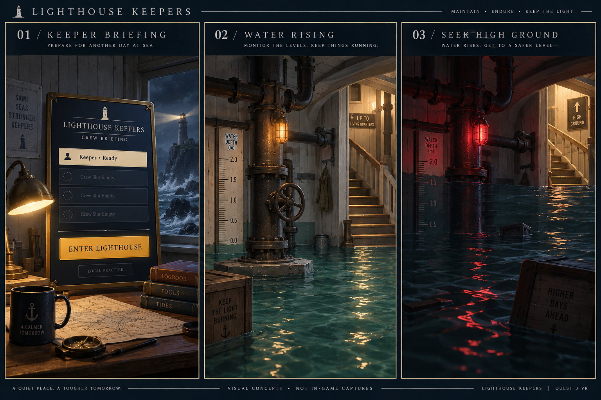

# Keeper briefing and flood concepts

Generated with the built-in imagegen tool on September 29, 2026. This is visual exploration, not a screenshot or a claim about implemented rendering. The runtime screen uses the briefing hierarchy and palette; the environmental art remains proposed.

## Generation prompt

Use case: stylized-concept. Asset type: one three-panel landscape game art direction board, explicitly proposed concept images, not screenshots of an existing build. Lighthouse Keepers is a standalone Quest 3 VR game, worn pale lighthouse on jagged rocks, low-poly maritime industrial interior, cold coastal blues and warm practical lights. Create three beautiful legible equal panels with restrained game-realistic detail appropriate to mobile VR. Panel 1 title '01 / KEEPER BRIEFING': eye-level view of a physical dark navy briefing board in the keeper house, brass frame, warm desk lamp, storm visible through window. Board title 'LIGHTHOUSE KEEPERS', subtitle 'CREW BRIEFING', one cream roster row 'Keeper • Ready', muted empty crew slots, large amber 'ENTER LIGHTHOUSE' button, small 'LOCAL PRACTICE' label. Panel 2 title '02 / WATER RISING': ground-floor circular plumbing room, pale worn timber, iron pipes and pump, shallow teal floodwater, readable vertical depth ruler and amber practical warning lamp, clear stairs to higher floor. Panel 3 title '03 / SEEK HIGH GROUND': same plumbing room now deeper darker water, restrained red emergency lamp and clearly visible warm-lit stairs with simple upward arrow sign 'HIGH GROUND'. Communicate water danger through environmental contrast and readable depth cues; no horror creatures, no headset HUD, no full-screen effects, no photorealistic expensive ray tracing. Consistent camera height, crisp art direction, understated editorial border and small footer 'VISUAL CONCEPTS • NOT IN-GAME CAPTURES'.
